  

  
  
  

Ingeniero de software enfocado en **sistemas con IA**, **APIs backend** y **apps móviles**. Me gusta llevar modelos a producción con decisiones trazables: la IA evalúa, reglas deterministas deciden.

---

## 🧰 Lenguajes y herramientas

<table>
  <tr>
    <td align="center" width="140"><b>Lenguajes</b></td>
    <td></td>
  </tr>
  <tr>
    <td align="center"><b>Frameworks</b></td>
    <td></td>
  </tr>
  <tr>
    <td align="center"><b>IA y datos</b></td>
    <td>
      
      
      
      
    </td>
  </tr>
  <tr>
    <td align="center"><b>Cloud y DevOps</b></td>
    <td></td>
  </tr>
</table>

---

## 🗂️ Proyectos por tecnología

###  &nbsp;Inteligencia Artificial

<table>
  <tr>
    <td colspan="2">
      <a href="https://github.com/jijaraba/LogiPulseAI_JEV"><b>⭐ LogiPulseAI_JEV</b></a> &nbsp;<code>destacado</code>
       
      Triage en tiempo real de excepciones en entregas de última milla. <b>Jev</b> (TypeSafe AI System One) evalúa cada evento y <b>guardrails deterministas</b> toman la decisión, de modo que cada veredicto es reproducible y cita la regla que lo produjo.
        
      
      
      
      
      
        
      
    </td>
  </tr>
  <tr>
    <td colspan="2" valign="top">
      <a href="https://github.com/jijaraba/efiempresa-vector"><b>efiempresa-vector</b></a>
       
      API de búsqueda semántica de documentos PDF con embeddings de OpenAI y PostgreSQL + pgvector.
        
      
      
      
    </td>
  </tr>
</table>

###  &nbsp;Backend y APIs

<table>
  <tr>
    <td width="50%" valign="top">
      <a href="https://github.com/jijaraba/sd-tasks-back"><b>sd-tasks-back</b></a>
       
      API REST de gestión de tareas con autenticación JWT, filtros, estadísticas y PostgreSQL (Sequelize).
        
      
      
      
      
    </td>
  </tr>
</table>

###  &nbsp;Móvil

<table>
  <tr>
    <td width="50%" valign="top">
      <a href="https://github.com/jijaraba/xpertgroup-cats"><b>xpertgroup-cats</b></a>
       
      App Flutter para explorar razas de gatos con TheCatAPI: carrusel, votaciones y animaciones Lottie.
        
      
      
    </td>
    <td width="50%" valign="top">
      <a href="https://github.com/jijaraba/Double_v_partners_flutter"><b>Double_v_partners_flutter</b></a>
       
      App Flutter con modelos y estados generados con <code>build_runner</code>.
        
      
      
    </td>
  </tr>
</table>

###  &nbsp;Frontend

<table>
  <tr>
    <td width="50%" valign="top">
      <a href="https://github.com/jijaraba/squadmakers-vue"><b>squadmakers-vue</b></a>
       
      SPA de personajes de Rick and Morty con Vue 3, composables y SCSS responsive.
        
      
      
      
    </td>
  </tr>
</table>

---

## 📈 Actividad

  

  

  <picture>
    <source media="(prefers-color-scheme: dark)" srcset="https://raw.githubusercontent.com/jijaraba/jijaraba/output/snake-dark.svg">
    
  </picture>

### ⚡ Actividad reciente

<!--START_SECTION:activity-->
<!--END_SECTION:activity-->

Las tarjetas de actividad se regeneran a diario con GitHub Actions.

